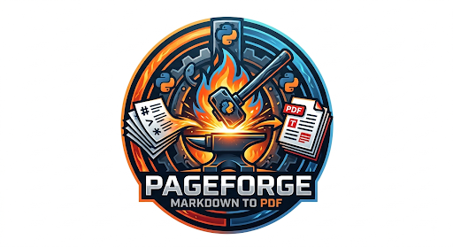

<div align="center">
  
</div>

# PageForge

Convert Markdown to professional PDFs with zero external dependencies.

PageForge is a pure Python CLI tool for converting Markdown documents to PDF using ReportLab. It's designed for LLM-generated content and works reliably on managed Windows machines without requiring Node.js, LaTeX, or system libraries.

## Key Features

- Pure Python implementation using ReportLab (no Node.js, no LaTeX)
- Comprehensive Markdown support: headings, lists, tables, code blocks, images
- Syntax highlighting for code blocks (via Pygments)
- SVG and raster image support (PNG, JPG)
- Interactive image resolution with smart fallback
- YAML configuration for fonts, colors, spacing, and layout
- Per-document overrides via frontmatter
- Command-line interface with minimal required options
- Optimized for LLM-generated markdown

## Requirements

- Python 3.10 or higher
- No external binaries or system dependencies required

## Installation

Install from source:

```bash
git clone https://github.com/medmond78/PageForge.git
cd PageForge
pip install -e .
```

After installation, verify the CLI is available:

```bash
pageforge --help
```

## Quick Start

Convert a markdown file to PDF with default settings:

```bash
pageforge document.md
```

This creates `document.pdf` in the same directory. You can specify an output path:

```bash
pageforge document.md -o output.pdf
pageforge document.md -o /output/directory/
```

## CLI Usage

### Basic Conversion

```bash
# Convert with automatic output name
pageforge document.md

# Specify output file
pageforge document.md -o report.pdf

# Specify output directory
pageforge document.md -o ./output/
```

### Custom Configuration

```bash
# Use a custom configuration file
pageforge document.md --config custom.yaml
```

See the [User Guide](docs/user-guide.md) for detailed configuration options.

### Interactive Image Resolution

By default, PageForge prompts you if images are missing. Use `--no-prompt` to disable:

```bash
# Non-interactive mode (fails if images missing)
pageforge document.md --no-prompt
pageforge document.md -n
```

This is useful for automated workflows or CI/CD pipelines.

## Configuration

PageForge works out-of-the-box with sensible defaults. You can customize output using a YAML configuration file.

Create a `pageforge.yaml` in your project directory:

```yaml
# Page layout
page:
  size: letter          # letter, a4, legal
  orientation: portrait # portrait, landscape
  margins:
    top: 1.0           # in inches
    bottom: 1.0
    left: 1.0
    right: 1.0

# Typography
fonts:
  body: Helvetica
  heading: Helvetica-Bold
  code: Courier
  sizes:
    h1: 24            # in points
    h2: 18
    body: 11
    code: 9

# Colors (hex format)
colors:
  text: "#000000"
  headings: "#1a1a1a"
  code_bg: "#f5f5f5"
  links: "#0066cc"

# Spacing (in points)
spacing:
  paragraph: 12
  heading_before: 18
  heading_after: 6
  line_height: 1.2

# Images
images:
  max_width: 6.5      # in inches
  max_height: 9.0
  dpi: 150
  center_align: true
  show_captions: true

# Code blocks
code:
  syntax_highlight: true
  theme: default
  show_line_numbers: false
  wrap_long_lines: true
```

See the [User Guide](docs/user-guide.md) for complete configuration reference.

## Supported Markdown Features

PageForge supports all standard Markdown features:

- Headings (H1-H6)
- Paragraphs with inline formatting (bold, italic, inline code)
- Ordered and unordered lists (including nested)
- Code blocks with syntax highlighting
- Tables
- Images (PNG, JPG, SVG)
- Blockquotes
- Horizontal rules
- Links (rendered as underlined text with URL)

For a complete feature reference, see the [User Guide](docs/user-guide.md).

## Documentation

- [User Guide](docs/user-guide.md) - Comprehensive guide with examples
- [Design Specification](docs/superpowers/specs/2026-08-11-pageforge-design.md) - Technical architecture

## Project Status

PageForge is feature-complete for the MVP release with 83/83 tests passing. All core features are implemented:

- Markdown parsing with extensions
- PDF generation via ReportLab
- Image resolution and embedding
- Configuration system
- CLI with interactive prompts
- Comprehensive test coverage

## License

MIT License - see LICENSE file for details.

## Contributing

PageForge is currently in initial development. For bugs or feature requests, please open an issue on GitHub.

## Why PageForge?

Most Markdown to PDF converters require external dependencies:

- Pandoc requires LaTeX installation (large, complex setup)
- WeasyPrint requires Cairo/Pango system libraries (difficult on Windows)
- Node-based tools require npm (often blocked on managed machines)

PageForge uses pure Python and installs via pip with zero system dependencies. It's designed specifically for:

- IT-managed Windows environments
- LLM-generated documentation
- Claude Code workflows
- Automated report generation

No Node.js. No LaTeX. No system libraries. Just Python.
